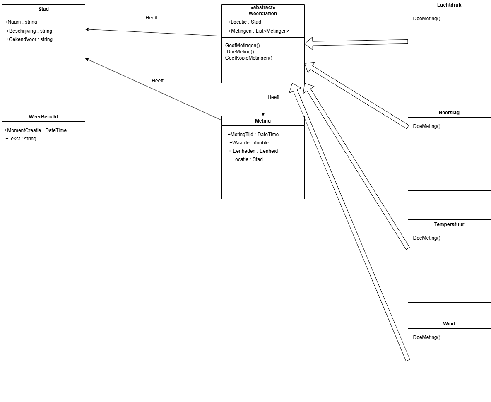

# WeerEvents - Weersomstandigheden Evalueren en Rapporteren

## Inleiding
WeerEvents is een applicatie voor het verzamelen en verwerken van meteorologische gegevens via verschillende weerstations verspreid over verschillende steden. De data wordt gebruikt om weerberichten te genereren.

---

## Installatie en Gebruik

1. Clone de repository
2. Open het project in Visual Studio / je favoriete IDE
3. Zorg dat het bestand `steden.json` aanwezig is in de juiste map (`WeerEventsRepo.Data`)
4. Bouw en start de applicatie
5. Gebruik een API-client om de endpoints te testen of test ze via de ingebouwde `Send request` knoppen in de ApiCalls.http

---

## Known issues

- Sommige functie en variabelen zou ik beter kunnen benoemen

---

## Domeinmodel

---

